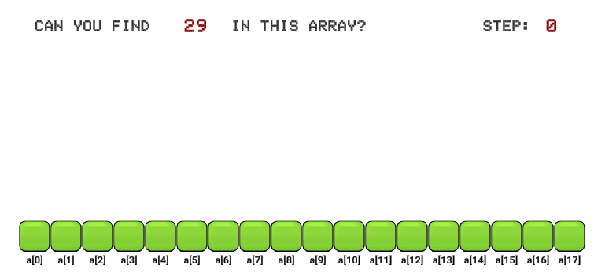
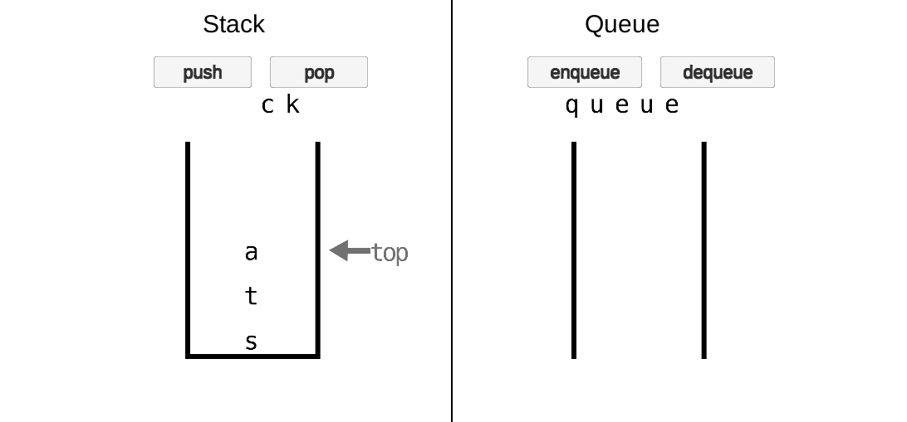
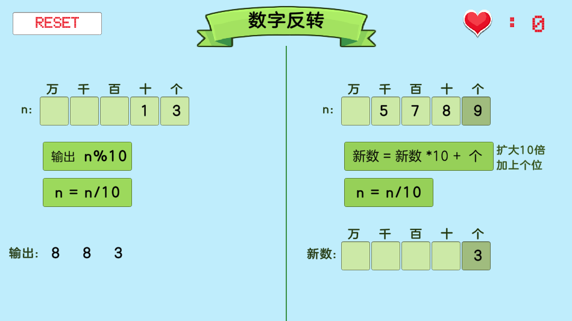
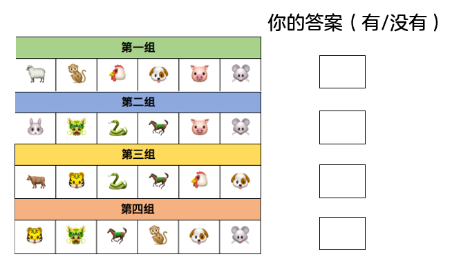
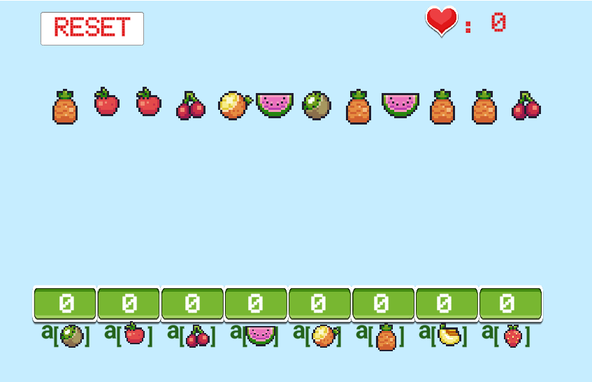
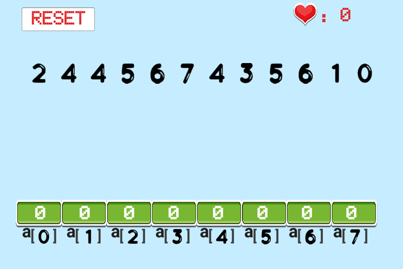
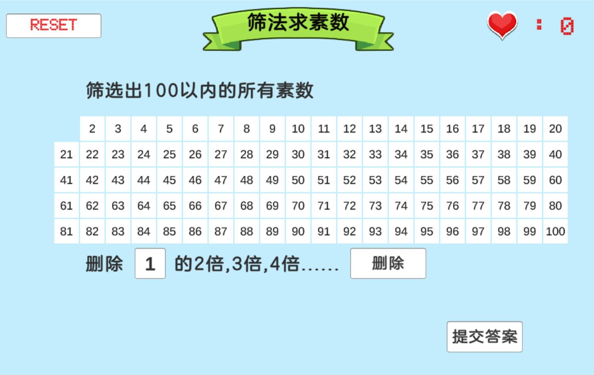

## 电子讲义

#### Unit1 众里寻他千百度:   [顺序查找](https://ayuki1024.github.io/L2_ebook/L2%E7%AC%AC1%E8%AF%BE%E9%A1%BA%E5%BA%8F%E6%9F%A5%E6%89%BE/%E9%A1%BA%E5%BA%8F%E6%9F%A5%E6%89%BE.html)
[<kbd></kbd>](https://ayuki1024.github.io/edu_game/shunxuchazhao/)

#### Unit2 先来后到讲规矩:   [栈与队列](https://ayuki1024.github.io/L2_ebook/L2%E7%AC%AC2%E8%AF%BE%E6%A0%88%E5%92%8C%E9%98%9F%E5%88%97/%E6%A0%88%E5%92%8C%E9%98%9F%E5%88%97.html)
[<kbd></kbd>](https://ayuki1024.github.io/edu_game/stackAndQueue/)

#### Unit3 关于数位的奥秘:   [数位拆分](https://ayuki1024.github.io/L2_ebook/L2%E7%AC%AC3%E8%AF%BE%E6%95%B0%E4%BD%8D%E6%8B%86%E5%88%86/%E6%95%B0%E4%BD%8D%E6%8B%86%E5%88%86)
[<kbd></kbd>](https://ayuki1024.github.io/edu_game/03modGame)

#### Unit5 初识0与1的世界:   [二进制](https://ayuki1024.github.io/L2_ebook/L2%E7%AC%AC5%E8%AF%BE%E5%88%9D%E8%AF%860%E4%B8%8E1%E7%9A%84%E4%B8%96%E7%95%8C%E4%BA%8C%E8%BF%9B%E5%88%B6/%E5%88%9D%E6%97%B60%E4%B8%8E1%E7%9A%84%E4%B8%96%E7%95%8C.html)
[<kbd></kbd>](https://ayuki1024.github.io/edu_game/05binary)

#### Unit6 一个萝卜一个坑:   [计数排序](https://ayuki1024.github.io/L2_ebook/L2%E7%AC%AC7%E8%AF%BE1%E4%B8%AA%E8%90%9D%E5%8D%9C1%E4%B8%AA%E5%9D%91/%E4%B8%80%E4%B8%AA%E8%90%9D%E5%8D%9C%E4%B8%80%E4%B8%AA%E5%9D%91.html)
<table><tr>
  <td><a href = "https://ayuki1024.github.io/edu_game/cntSortFruit/"><kbd></kbd></a></td>
  <td><a href = "https://ayuki1024.github.io/edu_game/cntSortNumber/"><kbd></kbd></a></td>
 </tr></table>

#### Unit7 筛法求素数:           [筛法](https://ayuki1024.github.io/L2_ebook/L2%E7%AC%AC7%E8%AF%BE%E7%AD%9B%E6%B3%95%E6%B1%82%E7%B4%A0%E6%95%B0/%E7%AD%9B%E6%B3%95%E6%B1%82%E7%B4%A0%E6%95%B0.html)
[<kbd></kbd>](https://ayuki1024.github.io/edu_game/07prime)

#### Unit11 冒泡排序:           [冒泡排序](https://ayuki1024.github.io/L2_ebook/L2%E7%AC%AC7%E8%AF%BE%E7%AD%9B%E6%B3%95%E6%B1%82%E7%B4%A0%E6%95%B0/%E7%AD%9B%E6%B3%95%E6%B1%82%E7%B4%A0%E6%95%B0.html)
[<kbd></kbd>](https://ayuki1024.github.io/edu_game/11 bubblesort)
